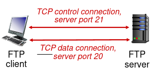
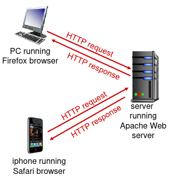
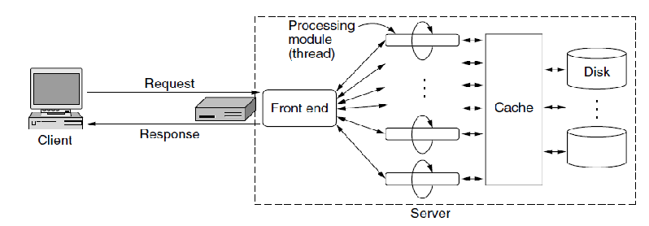
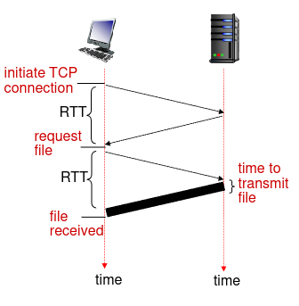
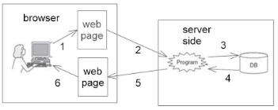
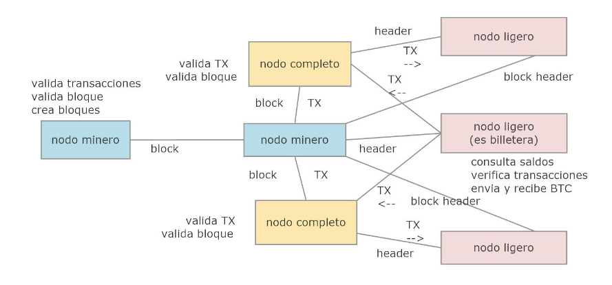

# Capa de Aplicacion de Internet

Existen dos enfoques para desarrollar aplicaciones de red para la internet:
1. El programador para especificar la comunicacion usa una **API**; una API es un conjunto basico de funciones. Para comunicar el software con la internet se usa la **Socket API**.
2. **La Web**: El programador se apoya en la tegnologia de la web para construir aplicaciones de red. La web provee servicios al software de la aplicacion que hacen mas facil a los desarrolladores implementar la comunicacion y la entrada/salida.

## Arquitectura de Aplicaciones

Las aplicaciones de red de internet suelen usar un **Estilo de Arquitectura**:
* **Cliente-Servidor**.
* ***Peer-to-Peer*** (**P2P**).
* **Arquitectura Orientada a Servicios**.
* **Microservicios**.

### Cliente-Servidor

En el modelo cliente-servidor existen dos procesos que se comunican entre si: uno en la maquina del cliente y otro en la maquina del servidor.

La forma en la que se comunica es:
1. El proceso **Manda una Solicitud** al proceso servidor.
2. El proceso cliente espera un **Mensaje de Respuesta**.
3. Luego el proceso servidor **Recibe y Procesa la Solicitud**.
4. El proceso servidor **Manda un Mensaje de Respuesta** al proceso cliente.

#### Caracteristicas de los servidores
* Siempre esta en un *Host*.
* Tienen direccion IP permanente.

#### Caracteristicas de los clientes
* Pueden esta conectados **Intermitentemente**.
* Usan direcciones IP dinamicas.
* Los clientes no se comunican directamente entre si.

#### Aplicaciones Cliente-Servidor en Internet Usando UDP

Los pasos de una aplicacion cliente-servidor en internet cuando usa el protocolo **UDP** (***User Datagram Protocol***) son los siguientes:
1. El cliente **Crea un Datagrama con IP** y **Puerto de Servidor**, y lo **Envia** (los datagramas pueden perderse). 
2. Si llegan, el servidor **Lee el Datagrama**.
3. El servidor **Envia una Respuesta** especificando direccion y puerto de cliente.
4. Si llega, el cliente **Lee el Datagrama**.
5. El cliente finaliza.

El problema que se puede ver usando el protocolo UDP es que no se dice que se hace si la respuesta no llega al cliente.

#### Aplicaciones Cliente-Servidor en Internet Usando TCP

Los pasos de una aplicacion cliente-servidor en internet cuando usa el protocolo **TCP** (***Transmission Control Protocol***) son los siguientes:
1. Se **Ejecuta** el proceso del servidor.
2. El servidor **Espera** por pedido de conexion entrante.
3. El cliente **Requiere** pedido de conexion al servidor.
4. El servidor **Acepta** la conexion con el cliente.
5. El cliente **Envia un Pedido** al servidor.
6. El servidor **Lee el Pedido**.
7. El servidor **Envia la Respuesta**.
8. El cliente **Lee la Respuesta**.
9. Si hay mas pedidos, entonces el cliente vuelve al paso 5.
10. El cliente **Cierra** la conexion.
11. El servidor **Cierra** la conexion.

#### Distribucion de Archivos

¿Cuanto tiempo se requiere para distribuir un archivo (de tamaño `F`) de un servidor a `N` compañeros?

¿Que parametros hay que considerar?
* Tasa de subida del enlace de acceso al compañero `i`: $u_{i}$.
* Tasa de subida del enlace de acceso al servidor: $u_{s}$.
* Tasa de descarga del enlace de acceso al compañero `i`: $d_{i}$.
* Tamaño del archivo a ser distribuido: $F$.
* Numero de compañeros que quieren adquirir una copia del archivo: $N$.

El **Tiempo de Distribucion** es el tiempo que toma obtener una copia del archivo por los `N` compañeros. Asumimos que la internet tiene abundante ancho de banda y todos los cuellos de botella suceden en ISP de acceso. Tambien asumimos que los servidores y clientes no participan de otra aplicaciones de red.

**Transmision del Servidor**: Debe enviar secuencialmente (subida) `N` copias de archivo a cada *peer* (manda `NF` bits).
* El tiempo para enviar 1 copia: $\frac{F}{u_{s}}$.
* El tiempo para enviar `N` copias: $\frac{NF}{u_{s}}$.

**Descarga del Cliente**: Cada cliente debe descargar una copia de archivo.
* $d_{min}$ = $min{d_{1},d_{2},\ldots,d_{N}}$.
* Tiempo de descarga del cliente con $d_{min}$: $\frac{F}{d_{min}}$ segundos.

### Arquitectura P2P

El modelo de arquitectura ***peer-to-peer*** (**P2P**) es una red descentralizada donde cada **Nodo** (***Peer***) funciona simultaneamente como cliente y servidor, compartiendo recursos, ancho de banda o almacenamiento directamente con otros sin un servidor central. Mientras mas haya mas nodos, mejor sera el funcionamiento ya que muchos comparten recursos con los que necesitan y no saturan la red.

#### Distribucion de Archivos

* Al comienzo solo el servidor tiene el archivo. 
* Para que la comunidad de compañeros reciba este archivo, el servidor debe enviar cada bit del archivo al menos una vez en su alcance de acceso.
* En P2P cada compañero puede redistribuir cualquier porcion del archivo que ha recibido a cualesquiera otros compañeros. Asi los compañeros asisten al servidor en el proceso de distribucion. Cuando un compañero recibe algo de datos de un archivo, puede usar su capacidad de subida para distribuir los datos a los otros compañeros.
* La **Capacidad Total de Subida** es:

$$u_{total} = \sum_{i=1}^{N} u_{i}$$

* Por lo tanto el **Tiempo Minimo de Distribucion** es:

$$\frac{F}{u_{total}}$$

**Transmision del Servidor**: Debe subir al menos una copia.
* El tiempo para enviar una copia: $\frac{F}{u_{s}}$.

**Cliente**: Cada cliente debe descargar la copia de un archivo.
* Tiempo minimo de descarga de cliente: $\frac{F}{d_{min}}$.

**Clientes**: Como agregado deben subir `NF` bits.
* La tasa de subida maxima (tasa maxima limitante de descarga) es $u_{s} + \sum_{i=1}^{N} u_{i}$.

### Arquitectura Orientada a Servicios

En esta arquitectura se requiere ciertos requisitos:

**Requisitos Funcionales**: Estos requisitos definen las capacidades básicas necesarias para que el sistema opere y cumpla su propósito.
* **Provision de Servicios**: Los servicios deben ser capaces de proporcionar funcionalidades especificas.
* **Consumo de Servicios**: Los clientes (o sea aplicaciones o usuarios) deben poder solicitar y recibir servicios.

**Requisitos No Funcionales**:Estos requisitos se refieren a las características de calidad, comportamiento y restricciones del sistema, las cuales son críticas para su viabilidad técnica y operativa.
* **Interoperabilidad** entre servicios: La comunicacion entre servicios de manera efectiva independientemente de la plataforma  o lenguaje de programacion usado.
* **Reusabilidad**: Los servicios deben diseñarse para reutilizarse en diferentes contextos.
* **Escalabilidad**: Los servicios deben escalar segun sea necesario.
* **Fiabilidad**: Los servicios deben ser capaces de adaptarse a cambios en las necesidades del negocio.
* **Seguridad**: Garantizar la seguridad de los datos y las transacciones entre servicios.

La arquitectura orientada a servicios (SOA) organiza las aplicaciones en **servicios Reutilizables**  que se comunican entre si a traves de un bus de servicios. 
* Cada servicio realiza una funcion especifica y puede ser usado por diferentes aplicaciones. 
* En SOA los servicios se comunican entre si usando patros como solicitud-respuesta, publicar-suscribir o enviar-olvidar. 
* Los servicios son modulares y pueden actuar tanto como cliente como servidores dependiendo del contexto.
* **Nodos** (roles):
    * **Servicios Independientes**: Cada servicio tiene un rol definido.
    * **Bus de Servicios Empresarial**(**ESB**): Infraestructura de software que facilita la integracion y comunicacion entre los servicios.
    * **Clientes**: Consumen los servicios ofrecidos.
* **Mensajes de Comunicacion**:
    * **Clientes a ESB**: Solicitudes de servicios, datos a procesar.
    * **ESB a Servicios**: Enrutamiento de solicitudes a los servicios adecuados.
    * **Servicios a ESB**: Respuesta a las solicitudes, datos procesados.
    * **Servicios Entre Si**: Comunicacion para coordinar acciones y compartir datos.

### Arquitectura de Microservicios

**Requisitos Funcionales**:
* **Provisión de Servicios Especializados**: proporcionar funciones únicas y bien definidas.
* **Comunicación Entre Servicios**: para cumplir con tareas más complejas.
* **Consumo de Servicios**: los clientes o aplicaciones deben poder solicitar y recibir servicios de manera eficiente.

**Requisitos No Funcionales**:
* **Escalabilidad**: escalamiento independiente de cada servicio según demanda.
* **Flexibilidad**: en el desarrollo y despliegue, los servicios deben adaptarse a los cambios en las necesidades del negocio.
* **Mantenibilidad**: fácil implementar nuevas funcionalidades.
* **Seguridad**: se pueden implementar políticas de seguridad más centralizadas y consistentes a través de los servicios. Garantizar la seguridad de los datos y las transacciones entre servicios.
* **Independencia y Autonomía**: cada servicio debe ser capaz de desarrollarse, implementarse y escalarse de manera independiente.
* **Resiliencia**: los servicios deben diseñarse para tolerar fallos y mantener la operación continua, incluso si uno de ellos falla.

La Arquitectura de Microservicios es una evolcion de la SOA (Service Oriented Architecture). 
* La aplicacion se divide en pequeños **Servicios Independientes** que se comunican entre si a traves de APIs que no dependen de un lenguaje especifico. Cada microservicio se especializa en una sola tarea y se encarga de una funcionalidad especifica. Un microservicio puede actuar tanto como cliente cmo servidor dependiendo del contexto y la tarea que se esta realizando.
* Usa  APIs REST, o gPRC para la comunicacion.
* **Nodos** (roles):
    * **Servicios Independientes**: Componentes funcionales que interactuan entre si.
    * **API Gateway**: Intermediario que gestiona las solicitudes entre clientes y microservicios.
    * **Clientes**: Aplicaciones que consumen servicios.
* **Mensajes de Comunicacion**:
    * **Clientes a API Gateway**: Solicitudes de datos, comandos.
    * **API Gateway a Microservicios**: Ruteo de solicitudes a los microservicios correspondientes.
    * **Microservicios a API Gateway**: Respuesta a las solicitudes, resultados de las operaciones.
    * **Microservicios entre si**: Comunicacion inter-servicios para operaciones complejas.
* **Protocolos**: Se suele usar SOAP o REST para la comunicacion entre servicios.

---

## Protocolos de Capa de Aplicacion

Se debe definir en un protocolo de capa de aplicacion los siguientes aspectos:
* **Tipos de Mensajes Intercambiados**: Pueden ser de pedido o de respuesta.
* **Sintaxis del Mensaje**: Que campos hay en un mensaje y como los campos son delineados.
* **Semantica del Mensaje**: Significado de la informacion en los campos.
* **Reglas** de cuando y como los proceso envian y responden a mensajes.
* **Estado** de la aplicacion: En que consiste y como se lo mantiene.

Existen dos **Tipos de Protocolo**:
* **Protocolos Abiertos**: Son básicamente un lenguaje de comunicación cuyas reglas son públicas y accesibles para todos, Son definidos en RFCs. Permiten Interoperabilidad.
* **Protocolos Propietarios**: Son un protocolo de comunicación cuyas especificaciones no son públicas.

### Protocolo de Transferencia de Archivos (FTP) (*File Transfer Protocol*)

* Usado para transferir archivo hacia/desde *Host* remoto.
* Cada archivo tiene restricciones de acceso y posecion.
* FTP permite inspeccionar carpetas y mensajes de control textuales.

Este protocolo usa el modelo de cliente-servidor.
* El **Cliente**: Es el lugar que inicia la transferencia (hacia o desde el *Host* remoto).
* El **Servidor**: Es el *Host* remoto.

#### Tipos de Mensajes

En FTP se intercambian 3 tipos de mensajes:
1. Uso de **Comandos** enviados al servidor FTP, enviados como texto ASCII sobre un canal de control (como comandos de transferencia de archivos).
2. **Mensajes de Respuesta** a comandos del servidor FTP.
3. **Mensajes con Datos Enviados** (como listado de archivos, folder, etc.).

#### Reglas

Las reglas de FTP son:
1. El cliente FTP contacta al servidor FRP en el puerto 21, usando TCP.
2. El cliente es autorizado en la conexion de control.
3. El cliente inspecciona directorios remotos, envia comandos sobre la conexion de control y se comienza con la identificacion de usuario y *password*.
4. Cuando el servidor recibe un comando de transferencia abre una segunda conexion de datos TCP (para el archivo) con el cliente.
5. Luego de transferir un archivo, el servidor cierra la conexion de datos.

---

## La Web

### Datos e Informacion

Existen los conceptos de **Entidades** y **Relacion** entre entidades.
 Para las paginas web suelen ser importantes los **Datos** y la **Informacion**. Los datos se refieren a los datos de las entidades y relaciones, estos datos esta en bases de datos.
 Los datos se procesa de determinada manera y obtiene lo que se llama la Informacion; esa informacion puede obtenerse de distintas fuentes, los datos extraidos son juntados y organizados de determinada manera dando lugar a la informacion.

### Consultas y Navegacion

Los datos puede ser **Consultados**. Una **Consulta** suele describir usando un lenguaje los datos deseados.
 Existen los **Lenguajes de Consulta** que sirven para expresar consultas. Las consultas son precesadas por **Motores de Bases de Datos** para retomar los datos deseados.
 Se pueden consultar los datos para generar informacion.

Otra alternativa para ver los datos deseados es la **Navegacion**. Al navegar uno va viajando por una serie de pantallas que conteienen datos que desea inspeccionar, pero tambien se puede navegar pasando por pantallas de informacion.
 Llamamos **Hipertexto** a un conjunto de texto, cada uno de los cuales contiene enlaces a otros textos. Al seleccionar un enlace se muestra el texto deseado enlazado. Recorrer varios enlaces de hipertexto es navegar, por lo que el hipertexto es un modelo para navegar.
 Nos referimos con **Medias** a cosas como fotos, videos, audios, etc..
 Podemos generalizar hipertexto a **Hipermedia**; en hipermedia tenemos un conjunto de nodos, donde un nodo puede contener texto y medias. Cada nodo puede tener enlaces a otros nodos.

### Paginas web

Al trabajar con **Paginas Estaticas** (son documentas de algun formato como HTML, PDF, etc.) se torna muy ineficiente cuando la informacion cambia fracuentemente o cuanndo la informacion de la pagina varia de acuerdo a diferentes parametros. Nosotros queremos evitar tener que modificar a mano las paginas estatucas a cada rato o tener que producir demasiadas paginas estaticas.
 Para evitar esto usamos **Paginas Dinamicas**. Paginas HTML son generadas por medio de programas que ejecutan del lado del servidor, esos programas toman parametros de entrada, estos parametros suelen ser ingreasados como valores  de campos de formularios.

Si el servidor web tiene que construir paginas dinamicas puede ser ineficiente por los siguientes motivos:
1. La pagina nueva a generar dinamicamente en el servidor puede tener una parte importante en comun con la pagina que ya tiene el *browser*; y esa parte que se repite se genera de nuevo y tiene que enviarse de nuevo por la pared, esa parte repetida va a tener que ser interpretada de nuevo por el *browser*.
2. El cliente se queda bloqueado esperando luego de hacer un pedido HTTP al servidor web y recien puede continuar ejecutandose cuando recibe una pagina (estatica o generada estaticamente). Estos son los llamados **Pedidos Sincronicos**. Si el procesamiento de un pedido del lado del servidor toma mucho tiempo, el no puede usar la aplicacion web mientras tanto para otra cosa puede ser bastante desagradable para el usuario.

La solucion a estos problema es usar **Paginas Unicas**. Cuando se entra en la aplicacion web el servidor web manda una pagina unica al *browser*, esta contiene una interfaz con el usuario completa. La pagina unica esta escrita con HTML y JS.
 Desde la pagina unica se puede hacer pedidos de datos al servidor web, solo obtiene datos (puede ser por medio de scripts), no computa paginas. Luego de hacer pedido de datos la aplicacion puede seguir haciendo otras tareas mientras se procesa ese pedido. A esto se lo llama **Pedido Asincrono**.
 Cuando llegan los datos se actualiza la interfaz del usuario de la pagina unica en el *browser*. solo se cambia la parte de la UI que se necesite, todo esto se hace dentro del *browser*.

### URL

Un enlace incrustado en una pagina web necesita una manera de nombrar una pagina en la web; similarmente un objeto referenciado por una pagina web necesita una manera de ser nombrado.
 La solucion a esto es nombrando las paginas/objetos usando **URL** (**Uniform Resource Locator**). Las partes de una URL son:
* Nombre del protocolo (generalmente HTTP o HTTPS).
* Nombre de dominio de *host* que contiene la pagina.
* El nombre del archivo que contiene la pagina (camino al archivo).

Con un URL como los de antes no basta para especificar la pagina dinamica deseada o el programa que obtiene los datos deseados. Es necesario tener parametros para la creacion de paginas dinamicas o para el programa que obtiene datos (para apps de pagina unica). Ademas hace falta poder ingresar los parametros en el pedido HTTP.
 Solucion 1: el URL contiene nombre de programa y parametros. Los parametros son ingresados por medio de formulario HTML.
 Solucion 2: Los parametros se ingresan separados por `&` en un campo especial del pedido HTTP (llamado Cuerpo de la Entidad). Los URL tiene un tamaño maximo. Cuando los parametros exceden ese tamaño maximo no se puede usar la solucion 1; es ahi que se torna util la solucion 2.

### Sitios Web

Un **Sitio Web** es un conjunto de paginas web relacionadas localizadas bajo un unico nombre de dominio, y publicadas por al menos un servidor web, tipicamente producida por  una organizacion o persona.
 Una **Pagina de Inicio** (***Home Page***) de un sitio web es una pagina de entrada al sitio web que sirve de guia hacia las paginas que contienen la informacion necesaria. Es la pagina que se carga por *default* cuando el navegador busca por el sitio.

### Aplicaciones Web

Las **Aplicaciones Web** retornan y almacenan informacion usando scripts del lado del servidor (usando lenguajes de scripting como PHP, Perl, ASP, etc.) y del lado del *browser* ejecutan tambien scripts para diversas tareas (usando lenguajes como JS.). el objetivo principal de las aplicaciones web es que el usuario realice una o mas tareas.

### Navegador

Para ver las paginas web se usa un **Navegador** (***Browser***)
 ¿Como funcionan? El navegador permite pedir una pagina/objeto a un servidor web. Una pagina pedida puede ser estatica o dinamica o pagina unica. El servidor web retorna la pagina/objeto en respuesta al pedido del navegador. Si el navegador retorno una pagina, el navegador interpreta al texto y los comandos de formateo que contiene la pagina y despliega la pagina adecuadamente formateada en pantalla.

#### Comunicacion entre el *browser* y el servidor web

1. El cliente inicia una conexion TCP (crea un socket) con el servidor web, usando el puerto 80.
2. El servidor web acepta la conexion TCP del cliente.
3. Mensajes HTTP (mensajes del protocolo de capa de aplicacion) intercambiados entre el *browser* (cliente HTTP) y el servidor web (servidor HTTP).
4. La conexion TCP se cierra.

Con HTTP el servidor web no mantiene informacion acerca de pedidos del pasado del cliente.

### Servidores Web

A un servidor web se le proporciona el nombre de un archivo correspondiente a una pagina a buscar y regresar. Tambien se le puede proporcionar el nombre de un programa con parametros a ejecutar. Tambien se lo puede ver como una computadora que almacena software del servidor web y archivos como documentos HTML, imagenes, archivos, etc.

En el diseño anterior cada solicitud de pagina estatica requiere un acceso al disco para obtener el archivo. Esto es ineficiente porque la misma pagina estatica puede ser pedida innumerables veces.
 La solucion es usar una **Cache** de paginas estaticas en la memoria. Acceder a la pagina en la cache es mucho mas rapido que accederla desde el disco.

Hasta ahora un servidor web es un proceso con un solo hilo de ejecucion ¿Como se puede hacer al servidor web mas rapido?
 La solucion es la arquitectura con un **Modulo Front End** y **Modulos de Procesamiento** (MP) (hilos). Todos los MP tienen acceso a la cache y a uno o mas discos.

#### Pasos de un servidor web con multiples hilos para manejar pedidos de paginas estaticas.

1. Cuando llega una solicitud el front end la acepta y construye un registro corto que la describe.
2. Despues entrega el registro a uno de los MP.
3. Si se trata de pedido de pagina estatica, el MP primero verifica el cache para ver si el archivo esta alli.
4. Si el archivo esta en la cache, actualiza el registro para incluir un apuntador al archivo.
5. Si el archivo no esta en la cache, el MP inicia una operacion de disco. Cuando el archivo llega del disco, se coloca en la cache y se regresa al cliente.
6. Mientras uno o mas MP estan bloqueados esperando a que termine una operacion del disco, otros MP pueden estar trabajando en otras solicitudes.
7. Conviene tener ademas multiples discos, para que mas de un disco pueda estar ocupado al mismo tiempo.

### *Cookies*

Luego de retornar de una pagina web el servidor olvida que ha visto alguna vez a ese cliente particular ¿Como hacemos para que el servidor y el cliente sepan del estado de la sesion?
 La solucion: Los pedidos y respuesta HTTP se envian informacion de estado de sesion, para esto se usan las llamadas ***Cookies***. Una *cookie* es un pequeño archivo o cadena, el contenido toma la forma de `nombre=valor`. Ademas de su contenido hay otros campos en una *cookie*:
1. **Dominio** (nombre del dominio de destino del *cookie*): Cada dominio puede almacenar hasta 20 cookies por cliente.
2. **Ruta** en la estructura  del directorio del servidor: Identifica que partes del arbol de archivos del servidor podrian usar el *cookie*.
3. El **Campo Contenido** toma la forma de `nombre=valor`.
4. El campo **Expira**: Si este campo esta ausente el navegador descarta el *cookie* cuando sale. Si se proporciona una hora y una fecha; se mantiene la *cookie* hasta que expira ese horario.
5. El campo **Seguro**: Se usa para indicar que el navegador solo puede retornar la *cookie* a un servidor usando un transporte seguro. Esto se usa para aplicaciones seguras.

Con solo recibir *cookies* no alcanza, es necesario almacenarlas. Para esto usamos **Directorio de Cookies**; para que el navegador pueda almacenar *cookies* en el disco duro de la maquina del cliente.

#### Comunicacion de las *cookies*

* **Comunicacion de las *Cookies* al Cliente**: Cuando un cliente solicita una pagina web, el servidor puede proporcionar una *cookie* junto con la pagina solicitada.
* **Comunicacion de las *Cookies* al Servidor Web**: Antes que un navegador solicite una pagina a un sitio web, verifica su directorio de *cookies* para ver si el dominio al que esta solicitando la pagina ya coloco alguna *cookie*. De ser asi, todas las *cookies* para ese dominio se incluyen en el mensaje de la solicitud. Cuando el servidor web las obtiene, puede interpretarlas de la forma deseada.

---

## HTTP

### Necesidades para un Protocolo para la Web

Cosas que se necesita que soporte un protocolo para la web:
1. Pedido de paginas, de objetos, o de ejecucion de programas que generan paginas.
2. Manejo del estado de sesion.
3. Poder mantener el sistema de archivos del servidor web.
4. Recepcion de paginas por un *browser*.
5. Seguridad (encriptacion de mensajes).
6. Feedback adecuado cuando no se puede responder los pedidos.
7. Comunicacion confiable.

**HTTP** transfiere paginas web de servidores web a navegadores y manda pedidos de navegadores a servidores web.
 Tipos de mensajes soportados por HTTP:
* *HTTP-Request* (de navegador a servidor web).
* *HTTP-Response* (de servidor web a navegador).

### Conexiones HTTP

* **HTTP No Persistente** (El HTTP no persistente es un método de comunicación donde el cliente y el servidor establecen una nueva conexión TCP para cada objeto web solicitado, cerrándola inmediatamente después de la transferencia): A lo sumo un objeto se manda por conexion TCP, luego se cierra la conexion. Descargar multiples objetos requiere de muchas conexiones. Un problema es que para descargar una pagina estatica puede ser necesario establecer varias conexiones (una por cada objeto referenciado por la pagina), esto es ineficiente.
* **HTTP Persistente** (mantiene abierto el canal TCP entre cliente y servidor para múltiples solicitudes/respuestas, mejorando drásticamente el rendimiento al evitar el protocolo de enlace de tres vías en cada elemento): Multiples objetos pueden ser enviados a traves de una unica conexion TCP entre el cliente y el servidor. Bajo una misma conexion TCP los pedidos son procesados en orden y los resultados se mandan en orden. Soportado por HTTP 1.1

**RTT** (***Round Trip Time***): Es el tiempo necesario para que un paquete pequeño viaje del cliente al servidor y regrese al cliente.
 Tiempo de respuesta de HTTP no persistente para recibir un archivo:
* Un RTT para iniciar la conexion TCP.
* Un RTT para el pedido HTTP y el regreso de los primeros bytes de la respuesta HTTP.
* Tiempo de transmision del archivo.
* Por lo que el Tiempo de respuesta de HTTP no persistente = 2RTT + tiempo de transmision del archivo.

Con HTTP 1.1 se puede hacer varios pedidos bajo una misma conexio, pero van a ser procesados en orden y los resultados van a ser enviados en orden.
 Con HTTP 1.1 no se envian documentos al *browser* cuando se sabe que se los va a necesitar (se espera primero que se los pida); ademas no permite recibir varios pedidos, priorizarlos y enviar las respuestas en el orden mas conveniente.
 La solucion es usar HTTP 2.0: Por medio de mecanismos *server push* empuja archivos que sabe que van a necesitarse pero que el cliente puede no saber inicialmente. Las respuestas a los pedidos pueden volver en cualquier orden. HTTP 2.0 comprime los encabezados y los envia en binario para reducir uso de ancho de banda. Cada respuesta lleva un identificador de su pedido.

### Pedidos HTTP

Informacion que deberia tener un mensaje de pedido:
* En caso que se quiera recibir una pagina: El URL de un documento y la especificacion de programa que genera pagina web.
* El tipo de accion que se quiere hacer en el sistema de archivos del servidor web (meter paginas, borrar paginas, etc.).
* Mandar informacion sobre la maquina/software del cliente para que servidor web pueda retornar paginas adecuadas al cliente.
* Mandar informacion de estado de sesion para que el servidor se entere.
* Restricciones sobre el tipo de paginas que el cliente puede aceptar.

¿Como indicamos el tipo de accion que se quiere hacer? (Pedido de pagina o accion en el sistema de archivos del servidor web) Usamos un campo con el tipo de la accion requerida. En la primera palabra de la primera linea se pone el nombre del metodo solicitado.

HTTP tiene varios metodos de pedido:
* **POST**: Su función principal es enviar datos al servidor para que este los procese.
* **GET**: Solicita o recupera datos de un servidor. Ese metodo es usado en la URL.
* **PUT**: Metodo para actualizar datos en el servidor.
* **DELETE**: Borra el archivo especificado en el campo URL.
* **HEAD**: Simplemente solicita el encabezado de la respuesta del servidor web, sin la pagina o datos de la respuesta.
* **OPTIONS**: Permite que el cliente consulte al servidor por una pagina y obtenga los metodos y encabezados HTTP que pueden ser usados con esa pagina.

### Respuestas HTTP

Informaciones que deberia tener un mensaje de respuesta:
* Feedback adecuado sobre el pedido realizado.
* Pagina o documento solicitado.
* En ese caso informacion sobre el tipo de documento enviado
* Informacion de estado de sesion para mantener actualizado al cliente.

¿Como especificar en la respuesta HTTP el feedback sobre el pedido recibido? Usamos un codigo y un mensaje.
 **Linea de Estado**: Contiene un codigo de estado de 3 digitos que indica si la solicitud fue atendida.

¿Como mandar ademas de la pagina solicitada/datos solicitados informacion adicional en una respuesta HTTP? Indicamos el tipo de informacion de que se trata y luego la informacion en si. Se usan **Encabezados de Respuesta** que son pares; nombre de encabezado y valor.

Partes de una respuesta HTTP:
* Linea de Estado.
* Encabezados de Respuesta (opcional).
* Luego viene el cuerpo de la respuesta.

---

## HTML (*HyperText Markup Language*)

HTML es el lenguaje estandar para crear paginas web. Describe la estructura de una pagina web e indica al navegador como mostrar el contenido de la pagina.

Un documento HTML es una serie de **Elementos**. Un elemento es contenido encerrado entre **Etiquetas**, una etiqueta esta demarcada entre '<' y '>'. Ademas las etiquetas pueden tener o no **Atributos**. Un atributo tiene un nombre y un valor (que es un `string`) separados por '='.

### Paginas Dinamicas

Las paginas dinamicas son paginas web generadas por programas que se ejecutan en el servidor (posiblemente con una base de datos).

Tareas que suelen hacer las paginas dinamicas:
* Procesar parametros de formulario.
* Procesar encabezados de pedido HTTP.
* Pedir datos a fuentes de datos.
* Generar paginas web con los datos recibidos.
* Generar encabezados de respuesta HTTP.

Tegnologias para producir paginas dinamicas: PHP, Java Server Pages, etc.

Pasos para generar paginas dinamicas del lado del servidor:
1. Un usuario llena un formulario y hace click en el boton de envio.
2. Se envia un mensaje al servidor web con el contenido del formulario. Se proporcion el mensaje a un programa o una secuencia de comandos. El programa procesa el mensaje.
3. El programa solicita informacion a un servidor de base de datos.
4. El servidor de base de datos responde con la informacion requerida.
5. El programa genera una pagina HTML personalizada y la envia al cliente.
6. El *browser* muestra la pagina recibida al usuario.

---

## PHP

Enfoque PHP (***Hypertext Preprocessor***):
* Se definen paginas dinamicas mediante la insercion de comandos especiales dentro de paginas HTML.
* Para utilizar PHP el servidor web tiene que entender PHP. El codigo PHP es interpretado por un servidor web.

Algunas cosas que puede hacer PHP:
* PHP puede generar contenido de pagina dinamica.
* Puede operar con archivos en el servidor.
* Puede enviar y recibir cookies.
* Puede acceder a encabezados de pedido HTTP.
* Permite definir encabezados de respuesta HTTP.
* Permite acceder a base de datos.

Tipos de datos de PHP:
* `string`: Secuencia de caracteres entre comillas.
* `integer`: Numero entero.
* `float`: Numero con punto decimal o numero en forma exponencial.
* `boolean`: Valores booleanos (true o false).
* `array`: Arreglo que almacena varios valores en una variable.
* `object`: PHP permite definir clases y objetos.

---

# Capa de Aplicacion de Redes Blockchain

## Capa de Protocolo Base de Redes Blockchain

### Requisitos

* **Registro de Transacciones**: Capacidad de almacenar transacciones.
* **Consistencia de Estado del Sistema**: Todos los participantes deben tener una vision unificada del estado actual del sistema.
* **Descentralizacion**: Queremos que el registro opere sin una autoridad central que controle el sistema.
* **Inmutabilidad**: Una vez que las transacciones se agregan al registro, no pueden ser modificados ni eliminados.
* **Seguridad**: Los datos del registro deben estar protegidos contra alternaciones y accesos no autorizados.
* **Transparencia**: Todos los participantes deben poder ver y verificar las transacciones y los datos en el registro.
* **Consenso**: Los nodos de la red deben acordar la validad de grupos de transacciones antes de agregarlas al registro.
* **Escalabilidad**: El sistema debe ser robusto y capaz de recuperarse rapidamente frente a fallas o ataques.
* **Privacidad**: Debe garantizarse la confidencialidad de ciertos datos y transacciones cuando sea necesario.

### Cadenas de Bloques

Es una estructura de datos descentralizada y cronologica que almacena infomracion en forma de bloques. Cada bloque contiene un conjunto de transacciones. Se tiene un **Red de Nodos Distribuidos** donde cada nodo tiene una copia completa de la blockchain.
 El **Hash de un Bloque** es un identificador unico del bloque generado mediante un algoritmo criptografico. Funciona como una "huella digital" del bloque y cambia si se modifica cualquier dato del bloque. Un *hash* hace extremadamente dificil alterar un bloque sin ser detectado. Los bloques de una cadena de bloques estan enlazados mediante ***Hashes***.

La **Estructura de un Bloque** es la siguiente:
* **Encabezado del Bloque**: Contiene metadatos cruciales para la integridad y verificacion.
* **Cuerpo del Bloque**: Almacena las transacciones realizadas.
* **Hash del Bloque**: Generado a partir de todos los datos contenidos en el bloque. Este *hash* garantiza que cualquier cambio resultaria en un nuevo valor completamente diferente, protegiendo asi la integridad e inmutabilidad del registro blockchain.

El **Encabezado del Bloque** contiene los siguientes datos:
* **Hash del Bloque Anterior**.
* ***Merkle Root***: Es el *hash* que resume todas las transacciones dentro del bloque.
* ***Nonce***: Numero aleatorio usado durante el proceso de mineria para encontrar un *hash* valido.
* ***TimeStamp***: Marca temporal indicando cuando se creo el bloque. Proporciona orden cronologico de los bloques.

¿Como se logran los requisitos?
* **Distribucion**: Uso de varios nodos con copia de blockchain.
* **Inmutabilidad**: Los bloques no pueden alterarse una vez agregados a la blockchain, cualquier cambio seria detectable porque alteraria el *hash* del bloque.
* **Transparencia**: Todas las transacciones son visibles publicamente.
* **Consenso**: Por medio de los mecanismos de consenso.
* **Rendimiento**: La eficiencia en la creacion de bloques y la validacion de transacciones depende de la implementacion especifica de la blockchain y su algoritmo de consenso.
* **Privacidad**: Se pueden implementar mecanismos para la privacidad.
* **Seguridad**: Se emplean algoritmos criptograficos para proteger los datos y las transacciones.
* **Consistencia**: Mediante mecanismos de consenso todos los nodos acuerdan que bloque es el siguiente en añadirse a la cadena.

### Mecanismos de Consenso

Los principales mecanismos de consenso son:
* ***Delegated Proof of Stake*** (**DPoS**): Los usuarios votan por delegados para validar bloques; estos delegados reciben recompensas por su trabajo. Los delegados pueden validar y agregar nuevas transacciones a la blockchain. Esto incluye validacion de bloques y confirmacion de transacciones. DPoS es rapido y eficiente.
* ***Byzantine Fault Tolerance*** (**BFT**): Un lider propone nuevos bloques mientras otros nodos verifican su validez antes del consenso generalizado. Luego de la validacion, se hace una votacion se hace una votacion por nodos participantes del consenso, para determinar si aceptan o rechazan el bloque propuesto.

### Bitcoin

#### Caracteristicas
* **Blockchain Publica**: Cualquiera puede unirse a la red, ejecutar un nodo y verificar transacciones.
* ***Permissionless***: No requiere permisos para participar como usuario, minero o nodo.
* Bitcoin usa el mecanismo de consenso **Proof of Work**.
* **Oferta Limitada**.
* Las transacciones suelen resolverse en minutos, aunque pueden tardar mas dependiendo de la congestion de la red.
* **Estructura de incentivos**: Los mineros reciben recompensas en BTC y tarifas de transaccion para mantener la red segura y operativa.
* **Tiempo de Bloque**: Aproximadamente 10 minutos en promedio para minar un nuevo bloque.

#### Servicios Provistos
* **Transferencia de Valor**: Permite enviar y recibir bitcoins de manera rapida y segura entre pares, sin intermediarios.
* **Almacenamiento de Valor**: Debido a su oferta limitada y su seguridad, es considerado como una reserva de valor .
* **Pagos Internacionales**: Facilita pagos internacionales con menores costos y tiempos de procesamiento comparado con los metodos tradicionales.
* **Seguridad y Verficacion de Transacciones**: Usa un sistema publico y transparente para evitar fraudes y doble gastos.
* **Bitcoin Script**: Soporta contratos inteligentes basicos a traves de su lenguaje de scripting, auntque con restricciones para mantener la seguridad.

#### Claves

Cada usuario tiene un par de claves:
* **Clave Privada** Secreta: Se genera un numero aleatorio. Generalmente las billeteras digitales generan esta clave.
* **Clave Publica** Compartida en la Red: Se aplica una formula matematica a la clave privada para generar esta clave. Generalmente se usa para ello el algoritmo ECDSA.

#### Funcion Hash

Una funcion hash es un algoritmo matematico que transforma datos de entrada de longitud variable en una cadena alfanumerica fija y unica, conocida como codigo hash.
 Las propiedades de una funcion hash son:
* **Determinismo**: Una funcion de hash produce siempre el mismo resultado para una entrada dada.
* **Eficiencia**: Las funciones de hash deben ser rapidas para calcular.
* **Resistencia a Colisiones**: Es practicamente imposible encontrar entradas diferentes que produzcan el mismo codigo hash.

#### Mineria de Bitcoin

**SHA-256** (***Secure Hash Algorithm 256-bit***) es un tipo especifico de funcion hash criptografica que se usa en Bitcoin y produce un codigo de hash de 256 bits.

Asi se usa SHA-256 en la mineria de Bitcoin:
1. Los mineros agrupan las transacciones pendientes en un **Bloque Candidatoa**.
2. Se crea el **Encabezado del Bloque**. El mismo contiene hash del bloque anterior, raiz de Merkle, marca de tiempo actual, nonce. El **Nonce** es un numero de 32 bits que se modifica repetidamente durante el proceso de mineria.
3. Se aplica el Algoritmo SHA-256 dos veces al encabezado del bloque.
4. Si el hash obtenido no cumple con los requisitos de dificultad establecidos por la red, el nonce se incrementa aleatoriamente y se repite el proceso hasta encontrar un hash valido. Para ser valido debe cumplir; el doble hash SHA-256 del bloque completo debe tener un numero especifico de ceros iniciales.
5. Una vez encontrado un hash valido, el minero difunde el nuevo bloque a la red.
6. Los nodos verifican el trabajo realizado y añaden el bloque a la blockchain.
7. Los otros nodos mineros que estaban tratando de crear sus bloques validos pierden el trabajo realizado hasta ese momento.
8. El minero recibe una recompensa en bitcoins por su trabajo, asi como las tarifas de las transacciones incluidos en el bloque.

Si dos nodos mineros generan un bloque valido al mismo tiempo, ¿Como evitar que se generen blockchains diferentes?
 Diferentes nodos reciben uno u otro bloque y lo añaden a su copia local de la blockchain. El siguiente minero en encontrar un bloque valido lo añadira a la cadena que esta usando. La cadena que se extiende mas rapido que se convierte en la principal. El bloque que no fue extendido se convierte en un bloque huerfano y es descartado. Los nodos que tenian la cadena mas corta abandonan esa cadena y se pasan a la cadena mas larga. El minero cuyo bloque se convierte en huerfano no recibe la recompensa por su trabajo.

#### Firmas Digitales

Una **Firma Digital** se genera en funcion de los datos de una transaccion, la firma es unica para cada transaccion. La clave privada del usuario es usada para firmar transacciones y demostrar la propiedad de los bitcoins. La clave publica es usada para verificar la firma. El remitente crea un hash de la transaccion y lo cifra con su clave privada, produciendo la firma digital.
 **Verificacion de la Firma**: Los nodos de la red utilizan la clave publica del remitente para descifrar la firma y compara el hash resultante con el de la transaccion. Si coinciden, la firma es valida.

#### Tipos de Nodos

* **Nodos Completos**: Validan y transmiten transacciones y bloques. Mantienen copia completa de la blochchain.
* **Nodos Mineros**: Crean nuevos bloques a traves de la mineria.
* **Nodos Ligeros**: Verifican transacciones usando informacion resumida. Obtienen informacion necesaria de nodos completos. Consultan saldos, envian y reciben BTC (Criptomoneda de Bitcoin).
* **Supernodos**: Actuan como hubs de alta capacidad, conectandose a muchos otros nodos y facilitando la distribucion de datos.

#### Envio y Validacion de Transacciones

1. **Usuario** envia transaccion a nodo completo.
2. **Nodo completo** verifica la validez de la transaccion recibida. Luego difunde la transaccion a otros nodos completos y supernodos.
3. **Supernodo** retransmite transaccion recibida de nodo completo a muchos otros nodos completos y ligeros a los que esta conectado.
4. **Nodo Ligero** recibe transaccion de supernodo, la verifica usando la informacion resumida, si la verificacion es exitosa, la acepta.
5. **Nodo Ligero** recibe la transaccion del nodo completo o supernodo. Incluye la transaccion en un bloque candidato y empieza a minar.
6. **Nodo Completo y Supernodo** continuan propagando la transaccion a otros nodos en la red hasta que todos la hayan recibido.

#### Mineria y Propagacion de un Nuevo Bloque

1. **Nodo de Mineria** Resuelve un problema matematico criptografico y crea un nuevo bloque con las transacciones recientes. Difunde el nuevo bloque a un nodo completo.
2. **Nodo Completo** verifica la validez del bloque recibido. Si el bloque es valido, lo agrga a su blockchain. Diifunde el bloque a otros nodos completos y supernodos.
3. **Supernodos** recibe y verifica el bloque que recibio del nodo completo, y si todo esta bien lo añade a su copia de la blockchain. Retransmite el bloque a muchos otros nodos completos y ligeros a los que esta conectado.
4. **Nodo Ligero** recibe el bloque del supernodo y verifica el bloque usando la cabecera del mismo y la cadena de bloque resumida. Si es valido, almacena su informacion resumida.

#### Respuesta a un Ataque de Doble Gasto

1. **Usuario Malicioso** envia dos transacciones conflictivas a diferentes nodos completos.
2. **Nodo Completo 1** recibe la primera transaccion y la verifica. Difunde esa transaccion a otros nodos completos y supernodos.
3. **Nodo Completo 2** recibe la segunda transaccion conflictiva y la verifica. Detecta el conflicto con la primera transaccion; rechaza la segunda transaccion y no la difunde.
4. **Supernodos** recibe la transaccion valida del nodo completo 1 y la difunde a otros nodos.
5. **Nodos de Mineria** recibe la primera transaccion valida y la incluye en un bloque candidato. Si la segunda transaccion llega despues de la primera, y se detecta el conflicto, la segunda transaccion es rechazada.

### Ethereum

La red Ethereum fue diseñada para descentralizar la web y permitir la creacion de Aplicaciones Descentralizadas (DApps) y contratos inteligentes.
 Su objetivo principal es eliminar intermediarios y proporcionar una plataforma transaparente, segura y autonoma para transacciones y acuerdos digitales.

#### Caracteristicas

* **Contratos Inteligentes**: Codigos autoejecutables que se activan cuando se cumplen condiciones predefindidas. Elimina la necesidad de confianza entre partes y reducen costos de intermediacion.
* **Descentralizacion**: Opera mediante una red global de nodos que validan y registran transacciones sin una autoridad central.
* **Token Nativo** (Ether - ETH): Utilizando como "combustible" para pagar transacciones y ejecutar contratos inteligentes.
* Maquina Virtual Ethereum (EVM): Proporciona un entorno seguro para ejecutar contratos inteligentes.
* **Inmutabilidad y Transparencia**: Todas las transacciones y contratos son registrados en la blockchain, lo que los hace verificables y resistentes a alteraciones.

#### Servicios Provistos

* **Desarrollo de DApps**: Permite a los desarrolladores crear aplicaciones descentralizadas.
* **Tokens Personalizados**: Facilita la creacion de tokens para representar activos digitales o fisicos.
* **Finanzas Descentralizadas** (**DeFi**): Plataforma para servicios financieros como prestamos, intercambios y seguros sin intermediarios.
* **Mercados Descentralizados**: Permite la creacion de plataformas de comercio P2P para bienes digitales y fisicos.
* **Gestion de Identidad y Datos**: Ofrece soluciones para almacenar y compartir datos de forma segura y descentralizada.

# FALTA TERMINAR LA CAPA DE APLICACION DE REDES BLOCKCHAIN